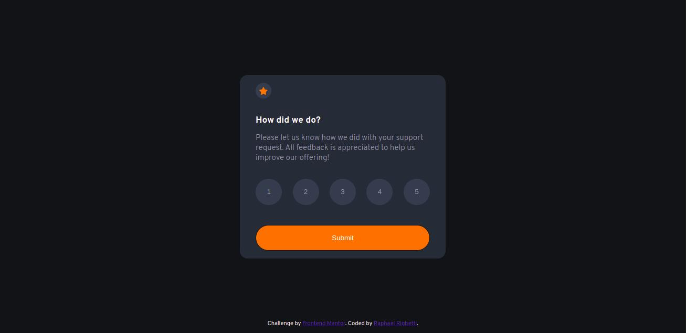

# Frontend Mentor - Interactive rating component solution

This is a solution to the [Interactive rating component challenge on Frontend Mentor](https://www.frontendmentor.io/challenges/interactive-rating-component-koxpeBUmI). Frontend Mentor challenges help you improve your coding skills by building realistic projects.

## Overview

### The challenge

Users should be able to:

- View the optimal layout for the app depending on their device's screen size
- See hover states for all interactive elements on the page
- Select and submit a number rating
- See the "Thank you" card state after submitting a rating

### Screenshot

### Links

- Solution URL: [Link to my solution on Frontend Mentor](https://www.frontendmentor.io/solutions/interactive-rating-component-using-html5-css-and-vanilla-javascript-rkPluN6Q9)
- Live Site URL: [Link to the live demonstration of the app](https://codepen.io/raphaelrighetti/pen/wvpjKgq)

## My process

### Built with

- HTML5
- CSS
- Vanilla JavaScript
- Flexbox
- CSS Grid
- Mobile-first workflow

### What I learned

Well, since this was a very simple project in terms of the programming logic and the JavaScript part in general, I put most of the effort on the CSS file, where I was able to practice everything I've been learning in the last weeks or so.
I tried to get the app looking as similar as I could to the original design, and this helped me a lot to get myself into a project that wasn't my own idea, so it helped me understand more of what doing something that people ask me to do is like, rather than doing something from start to finish taking things off of my own head.

### Continued development

In my future projects I will always try to write more clean and better code, focusing in learning new technologies, such as React, Next.js, Express and many more that I have interest in.
I'm loving to code things, and hopefully in the future I will be part of a really important project that I believe in. :)

### Useful resources

- [Link to MeyerWeb's Reset CSS](https://meyerweb.com/eric/tools/css/reset/) - This was the Reset CSS file that I used in this project. I use it in pretty much everything I do and it helps a lot. You should definitely check it out! 

## Author

- Website - [Link to Raphael Righetti's Website](https://raphaelrighetti.com/)
- LinkedIn - [Link to Raphael Righetti's LinkedIn](https://www.linkedin.com/in/raphael-righetti-ramos/)
- Frontend Mentor - [Link to @raphaelrighetti Frontend Mentor profile](https://www.frontendmentor.io/profile/raphaelrighetti)
- Twitter - [Link to @rapharighetti Twitter](https://twitter.com/rapharighetti)
- CodePen - [Link to Raphael Righetti's CodePen](https://codepen.io/raphaelrighetti)

## Acknowledgments

Big thanks to Frontend Mentor in general, I loved making this project and will be doing many more of their challenges from now on. <3